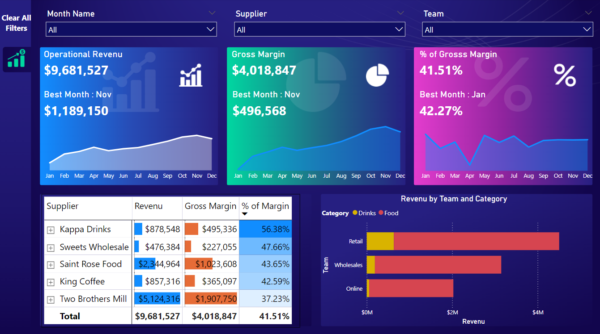

# Overview
  An analysis made on sales records through calculating revenue & cost over the sales teams & suppliers.
  
  For data source click her: [Source_Data](/Source_Data/Source_Data.rar/)

  Short video on LinkedIn: [Video](https://bit.ly/3WQ5XBZ)

# Tools Used
  * Power BI

# KPIs
  * Revenue
  * Gross Margin
  * % of Gross Margin

# The Analysis

  ### 1. Revenue, Gross Margin & % of Gross Margin by Suppliers
    
  ### 2. Revenue by Team & Category

  

  # Insights

  #### 1. Although "Two Brothers" Supplier has the highest Revenue but "Kappa Drinks" with a relatively high Revenue has the highest % of Margin.
  #### 2. Retails succeeded to acquire the highest Revenue for both categories "Food & Drinks".
